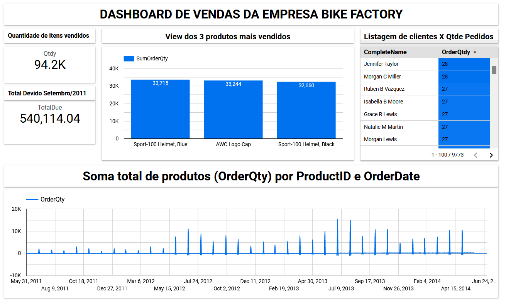

# Repositório do Projeto BikeFactory

## O problema: 

O presente problema se refere aos dados de uma empresa que produz bicicletas.

O objetivo deste desafio é compreender os seus conhecimentos e experiência analisando os seguintes aspectos:

1.	Fazer a modelagem conceitual dos dados;
2.	Criação da infraestrutura necessária;
3.	Criação de todos os artefatos necessários para carregar os arquivos para o banco criado;
4.	Desenvolvimento de SCRIPT para análise de dados;
5.	(opcional) Criar um relatório em qualquer ferramenta de visualização de dados.

Os seguintes arquivos devem ser importados (ETL) para o banco de dados de sua escolha: 

Acesse aqui o modelo relacional fornecido pelo cliente: [Modelo Relacional do Cliente](https://github.com/gittil/bike-factory/blob/main/images/modelo-relacional.jpg)

-	Sales.SpecialOfferProduct.csv
-	Production.Product.csv
-	Sales.SalesOrderHeader.csv
-	Sales.Customer.csv
-	Person.Person.csv
-	Sales.SalesOrderDetail.csv

Explicar qual arquitetura foi escolhida e porque?

# Análise de dados

Com base na solução implantada responda aos seguintes questionamentos:

1.	Escreva uma query que retorna a quantidade de linhas na tabela Sales.SalesOrderDetail pelo campo SalesOrderID, desde que tenham pelo menos três linhas de detalhes.

2.	Escreva uma query que ligue as tabelas Sales.SalesOrderDetail, Sales.SpecialOfferProduct e Production.Product e retorne os 3 produtos (Name) mais vendidos (pela soma de OrderQty), agrupados pelo número de dias para manufatura (DaysToManufacture).

3.	Escreva uma query ligando as tabelas Person.Person, Sales.Customer e Sales.SalesOrderHeader de forma a obter uma lista de nomes de clientes e uma contagem de pedidos efetuados.

4.	Escreva uma query usando as tabelas Sales.SalesOrderHeader, Sales.SalesOrderDetail e Production.Product, de forma a obter a soma total de produtos (OrderQty) por ProductID e OrderDate.

5.	Escreva uma query mostrando os campos SalesOrderID, OrderDate e TotalDue da tabela Sales.SalesOrderHeader. Obtenha apenas as linhas onde a ordem tenha sido feita durante o mês de setembro/2011 e o total devido esteja acima de 1.000. Ordene pelo total devido decrescente.

Resolução 

Para a realização deste teste, você deve utilizar alguma das principais nuvens públicas (Azure, AWS, GCP). Pedimos também que compartilhe conosco o código fonte (preferencialmente através de um repositório git público). 
A nossa expectativa é um processo de ingestão de dados utilizando os serviços da nuvem escolhida.
Além disso, inclua um arquivo README.md onde você deve compartilhar as decisões de arquitetura, implementação e instruções sobre como executar o software. Caso tenha criado um relatório em alguma ferramenta de visualização de dados, inclua um screenshot do mesmo no arquivo.

  

# Solução proposta

## Escolha da arquitetura e provedor de serviço de Cloud: 
Para solução do problema proposto foi utilizado a Google Cloud Plataform (GCP), em especial 4 serviços:

- **Cloud Storage** para criação do DataLake: Foi escolhido a Cloud Storage para nosso DataLake pela simplicidade, alta disponibilidade, custo baixo, segurança e integração nativa com as demais ferramentas que iremos utilizar, como por exemplo o DataProc.

- **Dataproc** para processamento dos dados: O Dataproc é um serviço totalmente gerenciado e escalonável para executar o Spark e mais de 30 ferramentas de código aberto. Foi utilizado o ambiente web JupyterLab para criação dos nossos notebooks de análise e tratamento, porém é possível criar scripts .py e rodar como **Jobs**, inclusive integrando com outros serviços como Pub/Sub e Dataflow para automatização do Pipeline.

- **BigQuery** para armazenamento dos dados na camada analítica: O BigQuery foi escolhido para ser o nosso Data WareHouse pois ele é um serviço sem servidor, altamente escalonávele e econômico.

- **Data Studio** para geração de gráficos: Para apresentação dos gráficos escolhemos a ferramenta  Google Data Studio pois ela tem integração nativa com mais de 560 conectores e custo free para uso, além de rodar em uma interface web.
  

### O DataLake foi dividido em 4 partes:
Consulte aqui a imagem do nosso [Datalake](https://github.com/gittil/bike-factory/blob/main/images/data-lake.png)

1. **Landing** area: Essa é a pasta local onde os arquivos recebidos por email foram salvos e ficam ali até o final do projeto.

2. **Raw** Stage: Essa camada do DataLake é a primeira camada na GCP. Ela recebeu todos os arquivos CSV de forma ainda bruta.  
Para carregar os arquivos locais na camada RAW, foi utilizado o seguinte scritp: [Load Raw to GCP](https://github.com/gittil/bike-factory/blob/main/ETL/1-raw-load/1-load-raw.ipynb)

3. **Refined** Stage: A camada REFINED recebeu todos os arquivos tratados que foram carregados a partir da camara RAW.  
Foi utilizado a biblioteca Pandas para fazer a manipulação dos dados (limpezas e tranformações, alteração de tipos, etc). 
Os notebooks com os tratamentos e todo detalhamento estão disponíveis em: [REFINED](https://github.com/gittil/bike-factory/tree/main/ETL/2-refined-transformation)

4. **Curated** Stage: Os dados carregados na camada CURATED vieram da camada Refined e receberam algum tipo de processamento mais complexo, como por exemplo JOIN´s e agregações. 
Essa será a camada do DataLake que poderá ser disponibilizada para DS's, DA's e BI's trabalharem modelos analíticos, tirar insigths, produzirem Dashboards, etc.  
Para processar os dados nessa camada foi utlizado o framework Spark com a interface PySpark e Spark SQL.  
O notebook com os códigos pode ser acessado aqui: [CURATED](https://github.com/gittil/bike-factory/blob/main/ETL/3-load-curated/load-curated.ipynb)

  

## Observações e Melhorias:

- Escolhi o formato de notebooks para processar os dados pela interatividade que a ferramenta possibilita, ao mesmo tempo que executamos comandos para tratar podemos ver o resultado.
- Uma melhoria futura, uma vez que já temos todo o trajeto para tratamento dos dados de cada arquivo, seria criar scripts .py e executar como jobs no Dataproc, utilizando os serviços Pub/Sub e Cloud Functions para disparar os Jobs sempre quando a camada RAW for atualizada e assim mater um certo nível de automação.
- Aplicar melhorias visuais no Dashboard

